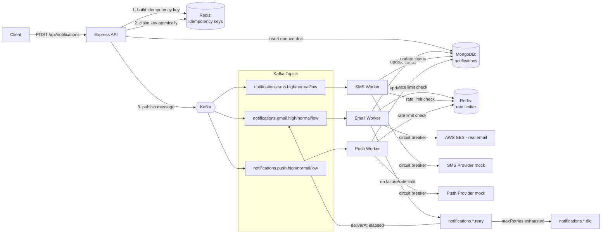

# Distributed Notification System (learning build)

An asynchronous, multi-channel (email / SMS / push) notification system built step-by-step with Node.js, Kafka, Redis, and MongoDB — as a deliberate learning exercise, not a one-shot generated project. Every file here was written (and debugged) line by line, with the reasoning and alternatives considered documented as we went.

**This README reflects the actual current state of the project, not the end goal.** See the status table below for what's really done vs. still to come.

## Why this exists

A naive "call the email/SMS provider directly from the request handler" approach breaks down fast: slow providers slow down your whole API, failures have no retry story, duplicate retries can send the same notification twice, and a flood of traffic can get you rate-limited or banned by the provider. The fix is to decouple *accepting* a notification request from *delivering* it: an API quickly queues the work, and independent background workers do the actual sending, with proper handling for retries, duplicates, and failures.

## Architecture (current + planned)



Solid lines/boxes = built and verified. Dashed lines/boxes = designed, not yet implemented.

## Status

| # | Piece | Status |
|---|---|---|
| 1 | Local infra (Kafka, Redis, MongoDB via Docker Compose) | ✅ Done |
| 1 | Priority modeling (separate topic per channel × priority) | ✅ Done |
| 2 | Ingestion API (`POST /api/notifications`) | ✅ Done |
| 2 | Idempotency (claim-before-publish, release-on-failure) | ✅ Done |
| 3 | Rate limiting (token bucket, atomic via Redis Lua script) | ✅ Done |
| 4 | Delivery workers (email/SMS/push consumers) | ✅ Done |
| 5 | Retry with exponential backoff | ✅ Done |
| 6 | Circuit breaker for provider failure isolation | ✅ Done |
| 7 | Dead-letter queue handling | ✅ Done |
| 8 | MongoDB persistence (durable notification status) | ✅ Done |

## What's actually implemented right now

- `docker-compose.yml` — Kafka (+ Zookeeper), Redis, MongoDB, on non-default ports (`9093`, `6380`, `27018`) to avoid colliding with other local projects.
- `src/kafka/topics.js` — topic naming: `notifications.<channel>.<priority>`, channels = `email|sms|push`, priorities = `low|normal|high`.
- `src/kafka/client.js`, `src/kafka/producer.js` — Kafka connection + a minimal `publish(topic, message)` helper.
- `src/config/env.js`, `src/config/redis.js` — centralized env config, shared Redis client.
- `src/services/idempotency.js` — `buildIdempotencyKey` (caller-supplied key or a derived SHA-256 hash of channel+recipient+payload), `claimIdempotencyKey` (atomic Redis `SET ... NX EX`), `releaseIdempotencyKey` (rollback on publish failure).
- `src/api/routes/notifications.js`, `src/api/server.js` — `POST /api/notifications` validates input, claims the idempotency key, publishes to the right topic, rolls back the claim if publishing fails. Returns `202` (queued), `400` (bad input), `409` (duplicate), or `500`.
- `src/services/rateLimiter.js` — `tryConsume(channel)`, a token bucket rate limiter per channel. The refill math (elapsed time × rate, capped at capacity) runs entirely inside a Redis Lua script via `EVAL`, so the whole "read bucket state, compute refill, decide, write back" sequence is one atomic operation - verified by `scripts/testRateLimiterRace.js`, which fires 20 concurrent requests at a bucket with capacity 5 and confirms exactly 5 get through.
- `src/kafka/consumer.js`, `src/workers/baseWorker.js` — generic Kafka consumer wrapper + per-channel worker factory. Each channel runs **three** separate consumers (one per priority), each its own consumer group, each with a different `partitionsConsumedConcurrently` (high=3, normal=2, low=1) - real priority-based concurrency, not just a field on the message.
- `src/providers/{sms,push}Provider.js` — still mocks, simulating network latency and a configurable random failure rate, so retry/breaker logic has real failures to react to. `src/providers/emailProvider.js` sends real email via AWS SES (see below) - the first provider actually wired up for real.
- `src/workers/{email,sms,push}Worker.js` — entrypoints, run via `npm run start:worker:<channel>`.
- `src/utils/backoff.js` — `computeBackoffMs(attempt, baseDelay, maxDelay)`: full-jitter exponential backoff, `random(0, min(baseDelay * 2^attempt, maxDelay))`.
- `src/kafka/topics.js` — `retryTopicFor(channel)`, one retry topic per channel (`notifications.<channel>.retry`), created alongside the priority topics in `scripts/createTopics.js`.
- `src/workers/baseWorker.js` — now also a Kafka *producer* (calls `connectProducer()` at startup), and runs a fourth consumer per channel against that channel's retry topic. On a rate-limited send, republishes to the retry topic with a short fixed delay (doesn't count against `maxRetries` - being over budget isn't a real failure). On a genuinely failed send, computes the next backoff via `computeBackoffMs` and republishes with an incremented `attempt` and a `deliverAt` timestamp. The retry-topic consumer holds each message until `deliverAt`, then republishes it onto its *original* priority topic, so it re-enters the normal flow exactly like a fresh message. After `maxRetries` attempts, the worker currently just logs "giving up" - becomes the dead-letter queue in Step 7.
- `src/services/circuitBreaker.js` — `callWithBreaker(channel, fn, config)` wraps a provider's `send` function with a three-state breaker (`closed` → `open` → `half-open`). Tracks *consecutive* failures per channel; once `failureThreshold` is hit, the breaker trips `open` and every call fails instantly (thrown `CircuitOpenError`) without touching the real provider, for `breakTimeoutMs`. After that cooldown, exactly one `half-open` trial call is allowed through (guarded by an in-flight flag so concurrent messages can't all become trial calls at once) — success resets to `closed`, failure immediately re-trips to `open`. State transitions are logged. Config is in `env.js` (`CIRCUIT_BREAKER_THRESHOLD`, `CIRCUIT_BREAKER_TIMEOUT_MS`).
- `src/workers/baseWorker.js` — `callWithBreaker` is called once per channel at worker startup (not per message), so the breaker's failure history persists across every message that channel handles, across all three priority consumers. A breaker rejection is caught by the same `try/catch` as a genuine send failure and goes through the identical retry/backoff path - the log line just distinguishes `circuit open` from `send FAILED` so it's clear from the logs whether the real provider was ever touched.
- `src/kafka/topics.js` — `dlqTopicFor(channel)`, one dead-letter topic per channel (`notifications.<channel>.dlq`), created alongside the other topics in `scripts/createTopics.js`.
- `src/workers/baseWorker.js` — once a notification exhausts `maxRetries`, instead of just logging and dropping it, it's published to the channel's DLQ topic with the original notification body plus `attempts` (how many sends were actually tried), `finalError`, and `deadLetteredAt`, so it's debuggable later without cross-referencing logs.
- `scripts/viewDlq.js` (`npm run dlq:view -- <channel>`) — a one-shot inspector that reads everything currently sitting in a channel's DLQ from the beginning and prints it, then exits after a few seconds of no new messages. Deliberately not a long-running consumer or an auto-processor (no alerting, no "retry from DLQ" admin action yet) - the DLQ today is purely "a place exhausted notifications are visible," checked on demand.
- **Known gap, by design:** nothing automatically alerts on new DLQ messages, and there's no way to manually retry a dead-lettered notification yet - both reasonable future extensions, intentionally not built now.
- `src/config/mongo.js` — shared MongoDB client, same `connect once, reuse everywhere` pattern as `kafka/client.js`/`config/redis.js`. `connectMongo()` at process startup, `getDb()` everywhere else (throws if called before connecting, so a forgotten connect step fails loudly at the exact wrong call site instead of silently).
- `src/dao/notificationDao.js` — every raw Mongo query lives here, and nowhere else; callers describe *what* happened ("this was sent," "this attempt failed") without knowing *how* it's stored. `createQueuedNotification` (called from the API right after a successful Kafka publish), `markAttemptFailed`/`markSent`/`markDeadLettered` (called from the worker at the matching points in `baseWorker.js`). `ensureIndexes()` sets up a unique index on `idempotencyKey` (the correlation key between the API's insert and the worker's later updates) plus a compound `{channel, status, createdAt}` index shaped for the dashboard queries this is ultimately for ("how many emails failed today," "status breakdown per channel over time").
- `src/api/routes/notifications.js` — now includes `idempotencyKey` in the published Kafka message body (it didn't before - the worker needs it to find the right Mongo document later), and writes the `queued` document right after a successful publish. This write is best-effort: Kafka is already the source of truth for delivery once published, so a Mongo failure here is logged, not thrown - it shouldn't turn an actually-queued notification into a failed API response.
- `src/workers/baseWorker.js` — same best-effort treatment on the worker side (a `recordSafely` wrapper logs and swallows Mongo errors rather than crashing message processing): `markSent` on success, `markAttemptFailed` on each retry (keeps `attempts`/`lastError` current on the one document, rather than one row per attempt), `markDeadLettered` when a notification is sent to the DLQ. Verified end-to-end: sent 3 notifications, one failed once before succeeding (document shows `attempts: 1` with the transient error preserved, `status: 'sent'`), two succeeded on the first try (`attempts: 0`).

## Key design decisions made so far (and why)

- **Separate Kafka topics per priority**, not a single topic with a priority field — Kafka only guarantees order within a partition by write order, so a priority field on a shared topic can't actually jump the queue without extra machinery. Separate topics + separate consumers per priority gives real prioritization.
- **Idempotency uses one atomic Redis `SET NX` call**, not a separate `GET` then `SET` — two round trips re-open a race condition where two concurrent duplicate requests could both see "not claimed yet" before either writes.
- **Claim the idempotency key *before* publishing, with an explicit rollback if publishing fails** (rather than claiming after success) — this closes the window where two concurrent duplicate requests could both slip through, at the cost of needing explicit cleanup on failure. See the idempotency section of our build log for the full tradeoff discussion.
- **Rate limiting's token-bucket math runs inside a Redis Lua script (`EVAL`), not as separate JS-side `GET`/`SET` calls** — same reasoning as idempotency: two round trips re-open a race condition (proven empirically: a non-atomic first draft let all 20 of 20 concurrent requests through against a bucket of capacity 5). The Lua script also asks Redis for the current time via `TIME` rather than using each caller's own clock, so results stay consistent across multiple worker processes/machines.
- **Retries go through a dedicated per-channel Kafka topic (`notifications.<channel>.retry`) + a scheduler consumer, not an in-process `setTimeout`** — Kafka has no native delayed-delivery, and an in-process timer would lose all pending retries if the worker restarted, and couldn't scale across multiple worker instances. Holding the message on a separate topic until its `deliverAt` time, then republishing onto the original priority topic, survives restarts and keeps retry traffic from clogging the primary topics/partitions.
- **Full-jitter exponential backoff (`random(0, min(base * 2^attempt, max))`), not fixed or deterministic exponential delay** — without randomness, every failed message retries on the exact same schedule, so a provider outage causes a "thundering herd" where all delayed retries slam the provider again at the same instant. Jitter spreads retries out.
- **Rate-limited sends retry on a short fixed delay and don't count against `maxRetries`**, separately from genuine send failures — being over budget is expected, self-correcting behavior (the bucket refills in under a second), not a sign of a broken provider, so it shouldn't eat into the same retry budget as actual failures.
- **The circuit breaker tracks *consecutive* failures, not a rolling failure rate** — simpler to implement and reason about, and still catches the main real-world case (a provider that's fully down). A rolling-window failure rate is more realistic for "degraded but not dead" providers but adds real complexity; noted as a possible future refinement, not built now.
- **Breaker state lives in-process memory, per worker process, not in Redis** — this worker only ever runs as a single process today, so there's nothing to share. If we ever ran multiple worker instances per channel, each would have its own independent breaker and could disagree about whether the provider is healthy; sharing state via Redis would fix that, at the cost of a round trip per call. Flagged as a known limitation of the current single-instance design, not solved yet.
- **A breaker rejection throws, rather than returning an error value** — so it flows through the exact same `try/catch` in `makeHandler` that already handles genuine provider failures, with zero changes needed to the retry/backoff logic. The log line is the only place the two cases are told apart.
- **The DLQ is written to, but nothing consumes it automatically** — a dedicated topic per channel keeps dead-lettered notifications durable and inspectable (survives worker restarts, unlike an in-memory list), without us having to build alerting or an admin UI yet. `scripts/viewDlq.js` is a manual, on-demand way to check it; automatic alerting or a retry-from-DLQ action are natural next steps, not built now.
- **Mongo access goes through a DAO (`src/dao/`), not ad-hoc queries scattered in the route and worker** — the API route and `baseWorker.js` call named functions (`createQueuedNotification`, `markSent`, ...) that describe intent, not raw `collection.updateOne(...)` calls with field names repeated at every call site. This matters specifically because the plan is a future analytics dashboard: when that's built, it can read through the same DAO (or a sibling read-side module), and if the schema or indexing strategy ever changes, there's exactly one file to update, not three.
- **Every Mongo write is best-effort (logged on failure, never thrown)**, both from the API and the worker — Kafka is the actual source of truth for whether a notification gets delivered; Mongo is a side-channel for visibility and analytics. A Mongo outage should degrade "the dashboard is a bit stale," not break notification delivery or turn a successfully-queued request into a 500.
- **One row per notification, updated in place, not one row per attempt** — a `retrying` status update overwrites the same document's `attempts`/`lastError` fields rather than inserting a new document per attempt. Keeps the collection's size proportional to notification volume, not retry volume, and makes "what's the current status of X" a single document lookup instead of "find the latest row for X."
- `src/providers/emailProvider.js` — now calls real AWS SES (`@aws-sdk/client-ses`) instead of simulating one. Kept the exact same `{ send, PROVIDER_NAME }` shape as the mock it replaced, so nothing else in the pipeline (worker, breaker, retry/backoff, DAO) needed to change - this is the entire point of having designed the provider interface as a swappable `sendFn` from the start. Config in `env.js`/`.env.example`: `AWS_REGION`, `AWS_ACCESS_KEY_ID`, `AWS_SECRET_ACCESS_KEY`, `SES_FROM_EMAIL`.
- **Known gap, by design, deferred for now:** the AWS SES account is still in sandbox mode (can only send to pre-verified recipient addresses; production access requested, pending AWS review) and there's no automated bounce/complaint handling yet (e.g. via SNS feedback) - a bounced or spam-complained address would currently just get retried like any other transient failure rather than being permanently suppressed. Noted as a real gap to address before sending to real, unverified end users at any volume, not built now since this is still a personal/learning-stage project with no live users.

## Running it locally

```bash
docker compose up -d
npm install
cp .env.example .env   # then edit if your ports differ
npm run setup:topics
node src/api/server.js
```

Test it:

```bash
curl -i -X POST localhost:3000/api/notifications \
  -H 'Content-Type: application/json' \
  -d '{"channel":"email","priority":"high","recipient":"you@example.com","payload":{"subject":"test"},"idempotencyKey":"demo-1"}'
```

Send the exact same request again and you should get `409 duplicate notification` instead of a second `202`.

## Next up

A final end-to-end pass: run the full system together (API + all three workers), confirm every piece still works in concert, and compare this build against the original v1 version now that every piece has actually been understood, not just generated. Beyond that, the natural follow-ups for the analytics dashboard idea are a read-side API over the `notifications` collection and, eventually, the productization phase (multi-tenant, configurable, sellable) that was explicitly deferred at the start of this rebuild.
