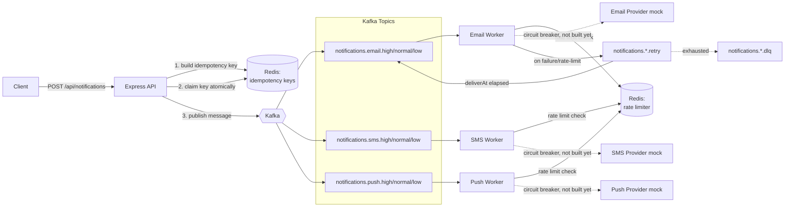

# Distributed Notification System (learning build)

An asynchronous, multi-channel (email / SMS / push) notification system built step-by-step with Node.js, Kafka, Redis, and MongoDB — as a deliberate learning exercise, not a one-shot generated project. Every file here was written (and debugged) line by line, with the reasoning and alternatives considered documented as we went.

**This README reflects the actual current state of the project, not the end goal.** See the status table below for what's really done vs. still to come.

## Why this exists

A naive "call the email/SMS provider directly from the request handler" approach breaks down fast: slow providers slow down your whole API, failures have no retry story, duplicate retries can send the same notification twice, and a flood of traffic can get you rate-limited or banned by the provider. The fix is to decouple *accepting* a notification request from *delivering* it: an API quickly queues the work, and independent background workers do the actual sending, with proper handling for retries, duplicates, and failures.

## Architecture (current + planned)



Solid lines/boxes = built and verified. Dashed lines/boxes = designed, not yet implemented.

## Status

| # | Piece | Status |
|---|---|---|
| 1 | Local infra (Kafka, Redis, MongoDB via Docker Compose) | ✅ Done |
| 1 | Priority modeling (separate topic per channel × priority) | ✅ Done |
| 2 | Ingestion API (`POST /api/notifications`) | ✅ Done |
| 2 | Idempotency (claim-before-publish, release-on-failure) | ✅ Done |
| 3 | Rate limiting (token bucket, atomic via Redis Lua script) | ✅ Done |
| 4 | Delivery workers (email/SMS/push consumers) | ✅ Done |
| 5 | Retry with exponential backoff | ✅ Done |
| 6 | Circuit breaker for provider failure isolation | ⬜ Not started |
| 7 | Dead-letter queue handling | ⬜ Not started |
| 8 | MongoDB persistence (durable notification status) | ⬜ Not started |

## What's actually implemented right now

- `docker-compose.yml` — Kafka (+ Zookeeper), Redis, MongoDB, on non-default ports (`9093`, `6380`, `27018`) to avoid colliding with other local projects.
- `src/kafka/topics.js` — topic naming: `notifications.<channel>.<priority>`, channels = `email|sms|push`, priorities = `low|normal|high`.
- `src/kafka/client.js`, `src/kafka/producer.js` — Kafka connection + a minimal `publish(topic, message)` helper.
- `src/config/env.js`, `src/config/redis.js` — centralized env config, shared Redis client.
- `src/services/idempotency.js` — `buildIdempotencyKey` (caller-supplied key or a derived SHA-256 hash of channel+recipient+payload), `claimIdempotencyKey` (atomic Redis `SET ... NX EX`), `releaseIdempotencyKey` (rollback on publish failure).
- `src/api/routes/notifications.js`, `src/api/server.js` — `POST /api/notifications` validates input, claims the idempotency key, publishes to the right topic, rolls back the claim if publishing fails. Returns `202` (queued), `400` (bad input), `409` (duplicate), or `500`.
- `src/services/rateLimiter.js` — `tryConsume(channel)`, a token bucket rate limiter per channel. The refill math (elapsed time × rate, capped at capacity) runs entirely inside a Redis Lua script via `EVAL`, so the whole "read bucket state, compute refill, decide, write back" sequence is one atomic operation - verified by `scripts/testRateLimiterRace.js`, which fires 20 concurrent requests at a bucket with capacity 5 and confirms exactly 5 get through.
- `src/kafka/consumer.js`, `src/workers/baseWorker.js` — generic Kafka consumer wrapper + per-channel worker factory. Each channel runs **three** separate consumers (one per priority), each its own consumer group, each with a different `partitionsConsumedConcurrently` (high=3, normal=2, low=1) - real priority-based concurrency, not just a field on the message.
- `src/providers/{email,sms,push}Provider.js` — mock providers simulating network latency and a configurable random failure rate, so later steps have real failures to react to. Swappable for real Twilio/SendGrid/FCM calls later without touching worker code.
- `src/workers/{email,sms,push}Worker.js` — entrypoints, run via `npm run start:worker:<channel>`.
- `src/utils/backoff.js` — `computeBackoffMs(attempt, baseDelay, maxDelay)`: full-jitter exponential backoff, `random(0, min(baseDelay * 2^attempt, maxDelay))`.
- `src/kafka/topics.js` — `retryTopicFor(channel)`, one retry topic per channel (`notifications.<channel>.retry`), created alongside the priority topics in `scripts/createTopics.js`.
- `src/workers/baseWorker.js` — now also a Kafka *producer* (calls `connectProducer()` at startup), and runs a fourth consumer per channel against that channel's retry topic. On a rate-limited send, republishes to the retry topic with a short fixed delay (doesn't count against `maxRetries` - being over budget isn't a real failure). On a genuinely failed send, computes the next backoff via `computeBackoffMs` and republishes with an incremented `attempt` and a `deliverAt` timestamp. The retry-topic consumer holds each message until `deliverAt`, then republishes it onto its *original* priority topic, so it re-enters the normal flow exactly like a fresh message. After `maxRetries` attempts, the worker currently just logs "giving up" - becomes the dead-letter queue in Step 7.
- **Known gap, by design, to be fixed in Step 7:** a notification that exhausts all retries is just logged and dropped - nothing routes it anywhere inspectable yet.

## Key design decisions made so far (and why)

- **Separate Kafka topics per priority**, not a single topic with a priority field — Kafka only guarantees order within a partition by write order, so a priority field on a shared topic can't actually jump the queue without extra machinery. Separate topics + separate consumers per priority gives real prioritization.
- **Idempotency uses one atomic Redis `SET NX` call**, not a separate `GET` then `SET` — two round trips re-open a race condition where two concurrent duplicate requests could both see "not claimed yet" before either writes.
- **Claim the idempotency key *before* publishing, with an explicit rollback if publishing fails** (rather than claiming after success) — this closes the window where two concurrent duplicate requests could both slip through, at the cost of needing explicit cleanup on failure. See the idempotency section of our build log for the full tradeoff discussion.
- **Rate limiting's token-bucket math runs inside a Redis Lua script (`EVAL`), not as separate JS-side `GET`/`SET` calls** — same reasoning as idempotency: two round trips re-open a race condition (proven empirically: a non-atomic first draft let all 20 of 20 concurrent requests through against a bucket of capacity 5). The Lua script also asks Redis for the current time via `TIME` rather than using each caller's own clock, so results stay consistent across multiple worker processes/machines.
- **Retries go through a dedicated per-channel Kafka topic (`notifications.<channel>.retry`) + a scheduler consumer, not an in-process `setTimeout`** — Kafka has no native delayed-delivery, and an in-process timer would lose all pending retries if the worker restarted, and couldn't scale across multiple worker instances. Holding the message on a separate topic until its `deliverAt` time, then republishing onto the original priority topic, survives restarts and keeps retry traffic from clogging the primary topics/partitions.
- **Full-jitter exponential backoff (`random(0, min(base * 2^attempt, max))`), not fixed or deterministic exponential delay** — without randomness, every failed message retries on the exact same schedule, so a provider outage causes a "thundering herd" where all delayed retries slam the provider again at the same instant. Jitter spreads retries out.
- **Rate-limited sends retry on a short fixed delay and don't count against `maxRetries`**, separately from genuine send failures — being over budget is expected, self-correcting behavior (the bucket refills in under a second), not a sign of a broken provider, so it shouldn't eat into the same retry budget as actual failures.

## Running it locally

```bash
docker compose up -d
npm install
cp .env.example .env   # then edit if your ports differ
npm run setup:topics
node src/api/server.js
```

Test it:

```bash
curl -i -X POST localhost:3000/api/notifications \
  -H 'Content-Type: application/json' \
  -d '{"channel":"email","priority":"high","recipient":"you@example.com","payload":{"subject":"test"},"idempotencyKey":"demo-1"}'
```

Send the exact same request again and you should get `409 duplicate notification` instead of a second `202`.

## Next up

Circuit breakers for provider failure isolation, then dead-letter queue handling for notifications that exhaust all retries.
